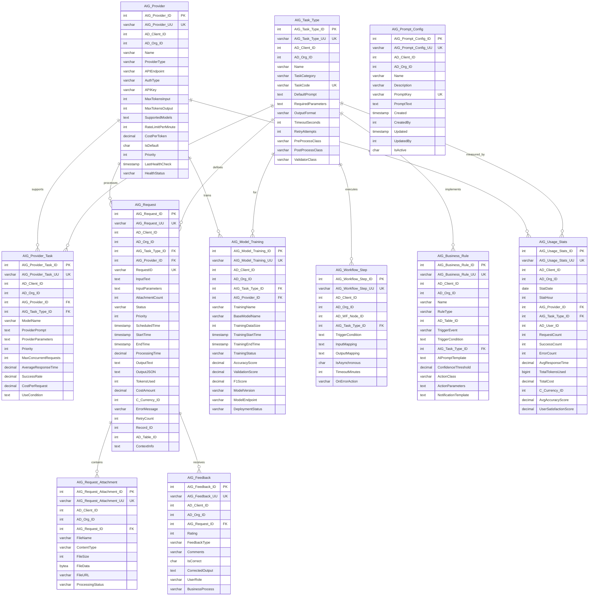

# iDempiere AI Data Model Architecture

## Overview

This document describes the comprehensive database architecture for integrating AI capabilities into iDempiere ERP. The model supports multiple AI providers, task management, request processing, learning/analytics, and workflow integration.

**Implementation Status**: This is a comprehensive architecture design. Currently, only **AIG_Prompt_Config** has been implemented as a minimal solution for configurable AI chat prompts (CLD-1606). The full architecture with 10 additional tables (AIG_Provider, AIG_Task_Type, etc.) is planned for future implementation.

---

## Entity Relationship Diagram



---

## Architecture Layers

### 0. Configuration & Setup Layer

#### AIG_Prompt_Config
**Purpose**: Configurable AI prompt templates for the chat interface (minimal implementation)

**Key Features**:
- Simple key-value storage for AI prompts
- Tenant-aware configuration (AD_Client_ID isolation)
- Currently used for chat system prompts
- Can be migrated to full AIG_Task_Type architecture later

**Schema**:
```sql
CREATE TABLE AIG_Prompt_Config (
    AIG_Prompt_Config_ID    NUMERIC(10) PRIMARY KEY,
    AIG_Prompt_Config_UU    VARCHAR(36) UNIQUE,
    AD_Client_ID            NUMERIC(10) NOT NULL,
    AD_Org_ID               NUMERIC(10) NOT NULL,
    Name                    VARCHAR(60) NOT NULL,
    Description             VARCHAR(255),
    PromptKey               VARCHAR(40) NOT NULL, -- Unique identifier (e.g., 'SYSTEM')
    PromptText              TEXT NOT NULL,        -- Actual prompt content
    Created                 TIMESTAMP NOT NULL,
    CreatedBy               NUMERIC(10) NOT NULL,
    Updated                 TIMESTAMP NOT NULL,
    UpdatedBy               NUMERIC(10) NOT NULL,
    IsActive                CHAR(1) DEFAULT 'Y' CHECK (IsActive IN ('Y','N')),
    CONSTRAINT AIG_Prompt_Config_PromptKey_idx UNIQUE (PromptKey, AD_Client_ID)
);
```

**Current Usage**:
- **PromptKey='SYSTEM'**: Main system instructions for AI chat assistant
- Loaded by `AIConversationService.buildSystemPrompt()`
- Replaces hardcoded prompt strings

**Use Cases**:
- Configure AI assistant behavior without code changes
- A/B test different prompt variations
- Tenant-specific prompt customization
- Quick iteration on prompt engineering

**Migration Path**:
When implementing the full AIG architecture:
1. AIG_Prompt_Config prompts can be imported into AIG_Task_Type.DefaultPrompt
2. PromptKey can map to AIG_Task_Type.TaskCode
3. Table can be deprecated or kept for simple key-value configs

**Example Data**:
```sql
INSERT INTO AIG_Prompt_Config (PromptKey, Name, PromptText)
VALUES ('SYSTEM', 'Chat System Prompt',
'You are a helpful AI assistant for iDempiere ERP system.
You have access to query the database to answer user questions...');
```

---

### 1. Core Configuration Layer

#### AIG_Provider
**Purpose**: Central registry of AI service providers (OpenAI, Anthropic, AWS Bedrock, etc.)

**Key Features**:
- Multi-provider support with priority-based routing
- Health monitoring and status tracking
- Authentication configuration (API Key, OAuth, AWS IAM)
- Rate limiting and cost tracking per provider
- Capability management (max tokens, supported models)

**Use Cases**:
- Register new AI providers
- Configure authentication credentials
- Monitor provider health and availability
- Implement failover strategies

#### AIG_Task_Type
**Purpose**: Defines reusable AI task templates

**Key Features**:
- Task categorization (OCR, NLP, Prediction, Classification)
- Default prompts and parameter schemas
- Java class hooks for pre/post processing
- Timeout and retry configuration
- Output format specification

**Use Cases**:
- Invoice OCR extraction
- Demand forecasting
- Sentiment analysis
- Document classification
- Product description generation

#### AIG_Provider_Task
**Purpose**: Maps providers to task types with specific configurations

**Key Features**:
- Provider-specific model selection (GPT-4, Claude-3-Sonnet)
- Custom prompts per provider
- Performance metrics tracking
- Conditional routing based on SQL rules
- Cost optimization through routing

**Use Cases**:
- Route OCR tasks to AWS Textract
- Route NLP to OpenAI GPT-4
- Fallback to cheaper models for simple tasks
- A/B testing different providers

---

### 2. Request Processing Layer

#### AIG_Request
**Purpose**: Tracks the complete lifecycle of AI requests

**Key Features**:
- Status management (PENDING → PROCESSING → COMPLETED/ERROR)
- Priority queue support
- Token usage and cost tracking
- Error handling with retry logic
- Business context linking (Record_ID, Table_ID)

**Request Flow**:
```
1. Request Creation → Status: PENDING
2. Provider Selection
3. Processing Start → Status: PROCESSING
4. AI API Call
5. Result Processing
6. Status: COMPLETED or ERROR
7. Feedback Collection (optional)
```

#### AIG_Request_Attachment
**Purpose**: Handles file attachments for multimodal AI tasks

**Key Features**:
- BYTEA storage for small files
- URL reference for large files (S3, etc.)
- Content type validation
- Per-attachment processing status

**Use Cases**:
- Invoice PDF for OCR
- Images for visual analysis
- Audio files for transcription
- Documents for summarization

---

### 3. Learning & Analytics Layer

#### AIG_Model_Training
**Purpose**: Tracks custom model training and fine-tuning

**Key Features**:
- Training lifecycle management
- Performance metrics (accuracy, F1 score)
- Model versioning
- Deployment status tracking

**Use Cases**:
- Fine-tune GPT on company-specific data
- Train custom classification models
- Track model performance over time

#### AIG_Feedback
**Purpose**: Captures user feedback for continuous improvement

**Key Features**:
- 1-5 rating scale
- Feedback type classification
- Corrected output for retraining
- Business process context

**Use Cases**:
- Improve OCR accuracy
- Adjust sentiment analysis
- Refine product recommendations
- Build training datasets

---

### 4. Integration Layer

#### AIG_Workflow_Step
**Purpose**: Embeds AI capabilities into iDempiere workflows

**Key Features**:
- Trigger condition evaluation
- Input/output mapping (JSON)
- Async/sync execution modes
- Error handling strategies

**Use Cases**:
- Auto-approve invoices below threshold
- Route documents based on content
- Generate purchase orders from emails
- Quality check product descriptions

#### AIG_Business_Rule
**Purpose**: Defines event-driven AI automations

**Key Features**:
- Database trigger integration
- Confidence threshold validation
- Custom action class execution
- Notification templates

**Use Cases**:
- Alert on suspicious transactions
- Auto-categorize expenses
- Flag duplicate vendors
- Validate customer master data

---

### 5. Monitoring Layer

#### AIG_Usage_Stats
**Purpose**: Aggregated analytics for cost and performance monitoring

**Key Features**:
- Hourly and daily aggregations
- Multi-dimensional analysis (Provider, Task, User)
- Cost tracking with currency support
- Performance metrics (response time, accuracy)

**Dashboard Metrics**:
- Total requests and success rate
- Cost per provider/task
- Average response time
- User satisfaction scores
- Token usage trends

---

## Data Flow Examples

### Example 1: Invoice OCR Processing

```
1. User uploads invoice PDF
   ↓
2. AIG_Request created (Task: INVOICE_OCR, Status: PENDING)
   ↓
3. AIG_Request_Attachment stores PDF
   ↓
4. System selects AIG_Provider (AWS Textract) via AIG_Provider_Task
   ↓
5. Pre-processor extracts metadata
   ↓
6. API call to AWS Textract
   ↓
7. Post-processor validates extracted fields
   ↓
8. AIG_Request updated (Status: COMPLETED, OutputJSON: {...})
   ↓
9. Invoice fields auto-populated
   ↓
10. AIG_Feedback collected from user verification
```

### Example 2: Demand Forecasting Workflow

```
1. Workflow Node: "Generate Forecast"
   ↓
2. AIG_Workflow_Step triggered
   ↓
3. InputMapping: Extract sales history, seasonality
   ↓
4. AIG_Request created (Task: DEMAND_FORECAST)
   ↓
5. Provider: OpenAI GPT-4 with time series prompt
   ↓
6. OutputMapping: Forecast → Workflow variables
   ↓
7. Next workflow node: "Review Forecast"
```

### Example 3: Duplicate Vendor Detection

```
1. New vendor created (INSERT trigger)
   ↓
2. AIG_Business_Rule activated
   ↓
3. TriggerCondition: "Check if similar vendor exists"
   ↓
4. AIG_Request: Compare name, address, tax ID
   ↓
5. Provider: OpenAI with semantic similarity
   ↓
6. ConfidenceThreshold check (>80%)
   ↓
7. ActionClass: NotifyPurchasingManager
   ↓
8. Notification sent with potential duplicates
```

---

## Materialized Views

### mv_ai_provider_performance
**Purpose**: Real-time provider performance dashboard

**Metrics**:
- Total requests (last 30 days)
- Success/error counts
- Average response time
- Token usage and costs
- User ratings

**Refresh Strategy**: Daily or on-demand

### mv_ai_task_analytics
**Purpose**: Task type performance analysis

**Metrics**:
- Request volume per task
- Average processing time
- Success rate by task category
- User satisfaction by task

**Refresh Strategy**: Weekly

---

## Security Considerations

### Access Control
- **Role-based access**: `idempiere_ai_service` role with limited permissions
- **Credential encryption**: API keys stored encrypted using pgcrypto
- **Audit logging**: All requests tracked with user context
- **Data isolation**: Client/Org multi-tenancy enforced

### Data Privacy
- **PII handling**: Sensitive data sanitized before AI processing
- **Retention policy**: Configurable data retention for compliance
- **Encryption at rest**: FileData in AIG_Request_Attachment
- **Encryption in transit**: HTTPS/TLS for API calls

---

## Performance Optimization

### Indexing Strategy
- **Composite indexes**: (AD_Client_ID, AD_Org_ID) on all tables
- **Status indexes**: Fast filtering of pending/processing requests
- **Date indexes**: Efficient time-range queries
- **Performance indexes**: (SuccessRate, AverageResponseTime)

### Partitioning
- **AIG_Request**: Partition by date (monthly)
- **AIG_Usage_Stats**: Partition by date (yearly)
- Benefits: Faster queries, easier archival

### Caching
- **Provider configs**: Cache in application layer
- **Task type definitions**: Rarely change, cache aggressively
- **Materialized views**: Pre-computed analytics

---

## Scalability Patterns

### Horizontal Scaling
- **Request queue**: Use message queue (RabbitMQ/Kafka) for async processing
- **Worker pool**: Multiple AI service workers
- **Load balancing**: Distribute across providers

### Vertical Scaling
- **Connection pooling**: Limit concurrent API calls per provider
- **Batch processing**: Group similar requests
- **Rate limiting**: Respect provider limits

---

## Integration Patterns

### 1. Synchronous Pattern
```java
AIRequest request = new AIRequest(ctx, taskTypeId, trxName);
request.setInputText(userQuestion);
request.process();
String result = request.getOutputJSON();
```

### 2. Asynchronous Pattern
```java
AIRequest request = new AIRequest(ctx, taskTypeId, trxName);
request.setInputText(document);
request.setAsync(true);
request.schedule();
// Process in background, notify on completion
```

### 3. Batch Pattern
```java
List<AIRequest> requests = createBatchRequests(documents);
AIBatchProcessor.processBatch(requests);
// All requests processed with optimal provider routing
```

---

## Monitoring & Alerting

### Key Metrics to Monitor
1. **Request throughput**: Requests per minute/hour
2. **Error rate**: Percentage of failed requests
3. **Response time**: P50, P95, P99 latencies
4. **Cost burn rate**: Spend per hour/day
5. **Provider health**: Availability percentage
6. **Token usage**: Rate of consumption vs. limits

### Alerts
- Error rate > 10% for 5 minutes
- Response time > 30 seconds
- Cost exceeds budget threshold
- Provider health check fails
- Queue depth > 1000 pending requests

---

## Migration Strategy

### Phase 1: Core Setup
1. Create sequences and tables
2. Set up triggers for automatic timestamps
3. Create base indexes
4. Configure initial providers

### Phase 2: Integration
1. Deploy AI service layer
2. Configure task types
3. Map providers to tasks
4. Test request processing

### Phase 3: Workflow Integration
1. Enable workflow steps
2. Configure business rules
3. Set up monitoring

### Phase 4: Optimization
1. Create materialized views
2. Implement partitioning
3. Fine-tune indexes
4. Enable caching

---

## Detailed Use Cases for iDempiere AI Integration

### Use Case 1: Chart Executive Overview - "Explain What I'm Seeing"

**Problem**: Dashboard users struggle to interpret complex charts and identify key insights quickly.

**Solution**: AI-powered chart analysis with interactive chat interface.

#### Workflow
1. **User clicks chart** → AI chat panel opens
2. **AI analyzes context**: Chart type, SQL query, data results, parameters
3. **AI generates executive summary** with key insights
4. **User asks follow-up questions** → AI provides deeper analysis

#### Context Extraction
- Chart metadata (title, type, period)
- SQL query structure
- Raw data results
- Filter parameters applied

#### AI Response Framework
- **What**: Chart shows (Sales YoY, period comparison)
- **Key Insight**: Main finding (top 3 reps = 80% volume)
- **Data Context**: Methodology (turnover excl. VAT, grouped by salespeople)

#### Example Response
> "This Sales YoY chart compares 2025 to 2024, showing turnover without VAT grouped by sales representatives. Key insight: The top 3 salespeople (Norbert, Reka, Diego) generate 80% of total sales volume, indicating high concentration of sales performance."

#### Technical Implementation
**AIG_Task_Type**: `CHART_ANALYSIS`
- Input: `{chart_type, sql_query, data_results, parameters}`
- Output: Executive summary + suggested questions
- Provider: OpenAI GPT-4 or Claude-3-Sonnet

**Essential Components**:
- Chart context parser
- SQL-to-insight translator
- Natural language query processor
- Data relationship mapper

---

### Use Case 2: Sales Opportunity Summary from Activities

**Problem**: Sales reps struggle to quickly understand opportunity status from 20+ communication entries (emails, calls, notes).

**Solution**: One-click AI summary with chat interface for deeper insights.

#### Workflow
1. **Trigger**: Click "AI Summary" button on Sales Opportunity screen
2. **Process**: AI analyzes all related communications/activities
3. **Output**: Instant summary dashboard showing:
   - Current stage & health score
   - Key stakeholders & sentiment
   - Critical action items
   - Next best actions
4. **Interactive**: Chat interface for follow-up questions

#### Data Sources
- Email threads
- Meeting notes
- Call logs
- Document attachments
- Status changes
- Customer interactions

#### AI Outputs
- Executive summary (3-5 bullets)
- Timeline of key events
- Risk indicators (red/yellow/green)
- Recommended next actions
- Sentiment analysis (positive/neutral/negative)

#### Example Summary
> **Opportunity Health**: Yellow (At Risk)
>
> **Key Points**:
> - Last contact 12 days ago - follow-up needed
> - Decision maker (Sarah Chen) showed strong interest in demo
> - Budget concerns raised in last call ($50K vs requested $75K)
> - Competitor mention: Evaluating Oracle NetSuite simultaneously
> - Next Action: Schedule pricing discussion with VP Finance
>
> **Sentiment Trend**: Positive → Neutral (declining engagement)

#### Technical Implementation
**AIG_Task_Type**: `OPPORTUNITY_SUMMARY`
- Input: `{opportunity_id, activities[], emails[], notes[]}`
- Output: JSON with health_score, summary, actions, sentiment
- Provider: OpenAI GPT-4 (context window needed for long threads)
- Response Time: <3 seconds

**Database Integration**:
```sql
SELECT * FROM C_Opportunity WHERE C_Opportunity_ID = ?
JOIN C_Activity ON C_Opportunity_ID
JOIN R_Request ON C_BPartner_ID
```

---

### Use Case 3: Customer Request Summarization for Helpdesk

**Problem**: Helpdesk agents receive messy emails or portal submissions that are hard to read and classify.

**Solution**: AI automatically extracts, classifies, and structures customer requests.

#### Workflow
1. **Input**: Raw customer request (email/portal submission)
2. **AI Processing**: Extract key information and classify
3. **Output**: Structured summary for helpdesk agent

#### Key Attributes to Extract
- **Request Type**: Bug, Feature Request, Support, Question
- **Priority**: High/Medium/Low (based on urgency indicators)
- **Category**: Module/functionality affected
- **Customer Info**: Company, contact details, subscription level
- **Issue Summary**: 2-3 sentence description
- **Required Actions**: What needs to be done
- **Status**: New/In Progress/Waiting for Info

#### Implementation Considerations
- **Text Classification**: Train model on historical tickets
- **Entity Extraction**: Pull out product names, error codes, dates
- **Sentiment Analysis**: Detect frustrated customers for priority handling
- **Auto-tagging**: Assign relevant labels for routing
- **Confidence Scoring**: Flag uncertain classifications for human review

#### Example Input (Messy Email)
```
Subject: URGENT!!! System not working again!!!

Hi there,

We tried to post invoices this morning like we always do but
the system keeps giving us this weird error message something
about "document not balanced" or whatever. This is the 3rd time
this month!!! We have customers waiting and can't send invoices.
Please fix ASAP!!!

Also while you're at it can you show me how to export the sales
report we talked about last week?

Thanks,
John
Acme Corp
john@acme.com
```

#### AI-Generated Summary
```json
{
  "request_type": "Bug",
  "priority": "High",
  "category": "Accounting - Invoice Posting",
  "customer_tier": "Premium",
  "issue_summary": "Invoice posting fails with 'document not balanced' error. Blocking critical business process. Recurring issue (3rd occurrence this month).",
  "required_actions": [
    "Investigate invoice posting error - URGENT",
    "Provide workaround for immediate invoice processing",
    "Schedule follow-up: Export sales report training"
  ],
  "sentiment": "Frustrated/Urgent",
  "confidence_score": 0.92,
  "suggested_assignee": "Accounting Support Team",
  "estimated_effort": "2 hours",
  "related_requests": ["REQ-2341", "REQ-2298"]
}
```

#### Technical Implementation
**AIG_Task_Type**: `REQUEST_CLASSIFICATION`
- Input: `{raw_text, customer_id, submission_source}`
- Output: Structured JSON summary
- Provider: OpenAI GPT-4 or Claude-3
- Post-processor: Validate categories against AD_Ref_List

**Database Fields** (extend R_Request table):
```sql
ALTER TABLE R_Request ADD COLUMN AI_Summary TEXT;
ALTER TABLE R_Request ADD COLUMN AI_Priority_Score DECIMAL(3,2);
ALTER TABLE R_Request ADD COLUMN AI_Category VARCHAR(60);
ALTER TABLE R_Request ADD COLUMN AI_Confidence DECIMAL(3,2);
ALTER TABLE R_Request ADD COLUMN AI_Sentiment VARCHAR(20);
```

---

### Use Case 4: Business Partner Communication Summary

**Problem**: Similar to sales opportunities - long communication history makes it hard to understand current relationship status.

**Solution**: AI-powered business partner relationship overview.

#### Workflow
1. **Trigger**: Click "AI Summary" on Business Partner window
2. **AI Analyzes**: All communications, orders, payments, support tickets
3. **Output**: Comprehensive relationship health dashboard

#### Data Sources
- Communication history (emails, calls, meetings)
- Order history and patterns
- Payment behavior
- Support ticket history
- Sales opportunities
- Contract renewals

#### AI Outputs
- **Relationship Health Score** (0-100)
- **Customer Lifetime Value** (predicted)
- **Churn Risk** (low/medium/high)
- **Key Contact Summary** (roles, engagement level)
- **Recent Highlights** (positive and negative)
- **Recommended Actions**

#### Technical Implementation
**AIG_Task_Type**: `BPARTNER_RELATIONSHIP_SUMMARY`
- Similar to Use Case 2 but broader scope
- Includes financial metrics and predictive analytics

---

### Use Case 5: Auto-Labeling for Records

**Problem**: Manual tagging/labeling of records is time-consuming and inconsistent.

**Solution**: AI automatically applies relevant labels on record save.

#### Workflow
1. **Trigger**: Record save (R_Request, C_BPartner, M_Product)
2. **AI Processing**: Analyze record content and context
3. **Auto-apply labels** based on AI classification
4. **User validation** (optional review step)

#### Use Cases by Table
- **R_Request**: Bug, Feature, Support, Urgent, Customer-Tier
- **C_BPartner**: Industry, Size, Region, VIP, At-Risk
- **M_Product**: Category, Price-Tier, Seasonal, Trending
- **C_Invoice**: Payment-Risk, High-Value, Disputed

#### Implementation
**AIG_Business_Rule**: Trigger on INSERT/UPDATE
```sql
CREATE TABLE AIG_Label (
    AIG_Label_ID INTEGER PRIMARY KEY,
    AD_Table_ID INTEGER,
    LabelName VARCHAR(60),
    LabelCategory VARCHAR(30),
    Color VARCHAR(7),
    IsAutoApplied CHAR(1) DEFAULT 'N'
);

CREATE TABLE AIG_Record_Label (
    AIG_Record_Label_ID INTEGER PRIMARY KEY,
    AD_Table_ID INTEGER,
    Record_ID INTEGER,
    AIG_Label_ID INTEGER,
    AI_Confidence DECIMAL(3,2),
    IsAIGenerated CHAR(1) DEFAULT 'N',
    IsValidated CHAR(1) DEFAULT 'N'
);
```

**AIG_Task_Type**: `AUTO_LABELING`
- Input: `{table_name, record_data, available_labels[]}`
- Output: `{suggested_labels[], confidence_scores[]}`

---

### Use Case 6: Improve Writing for Customer Support Responses

**Problem**: Support agents spend time crafting professional, clear responses. Quality varies by agent.

**Solution**: AI writing assistant for support responses.

#### Workflow
1. **Agent drafts response** in R_Request Action comment field
2. **Click "AI Improve"** button
3. **AI enhances text**: Grammar, tone, clarity, completeness
4. **Agent reviews and sends**

#### AI Enhancements
- **Grammar & Spelling**: Fix errors
- **Tone Adjustment**: Professional, empathetic, concise
- **Clarity**: Simplify technical jargon
- **Completeness**: Suggest missing information
- **Formatting**: Proper structure with bullets/sections

#### Example

**Original (Agent Draft)**:
```
hi the issue you reported is because you didnt set the
accounting schema correctly. you need to go to the setup
and configure it. let me know if you need help.
```

**AI-Improved**:
```
Hello,

Thank you for reporting this issue. I've identified the root cause:
the accounting schema hasn't been configured correctly.

To resolve this, please follow these steps:
1. Navigate to: System Admin → Accounting → Accounting Schema
2. Select your organization's schema
3. Ensure all required accounts are mapped
4. Save and retest invoice posting

I've attached a step-by-step guide with screenshots to assist you.
If you encounter any difficulties during setup, please don't hesitate
to reach out. I'm happy to schedule a quick screen-sharing session
to walk you through the process.

Best regards,
Support Team
```

#### Technical Implementation
**AIG_Task_Type**: `IMPROVE_WRITING`
- Input: `{draft_text, context, tone_preference}`
- Output: `{improved_text, change_summary[]}`
- Provider: OpenAI GPT-4 or Claude-3
- UI: Side-by-side comparison with accept/reject

---

### Use Case 7: Inbound Email Gateway Enhancement

**Problem**: Incoming emails contain clutter (signatures, footers, logos, disclaimers) that pollutes the database.

**Solution**: AI-powered email cleaning before storage.

#### AI Functions

**A. Improve Writing Quality**
- Fix typos and grammar in customer emails
- Standardize formatting
- Extract actionable content

**B. Remove Email Footers**
- Detect and strip signature blocks
- Remove confidentiality disclaimers
- Clean "Sent from my iPhone" footers
- Preserve only relevant content

**C. Remove Visual Clutter**
- Strip embedded logos and icons
- Remove tracking pixels
- Clean HTML to plain text/markdown
- Preserve essential images only

#### Workflow
```
Incoming Email
    ↓
AI Processing:
  - Extract core message
  - Remove signatures/footers
  - Clean HTML formatting
  - Remove small icons/logos
  - Improve writing quality
    ↓
Store Cleaned Content in R_Request
    ↓
Preserve Original in Archive
```

#### Example

**Raw Email (Before)**:
```html
<div>
   Hi there,

  We r having problems with the latest update. pls help!!!

  <div style="font-size:8px; color:#999;">
    Best Regards,<br>
    John Smith<br>
    Senior Procurement Manager<br>
    
    <br>
    Acme Corporation | www.acme.com<br>
    Phone: +1-555-0123 | Mobile: +1-555-0456<br>
    <br>
    CONFIDENTIALITY NOTICE: This email and any attachments...
    [200 more words of legal text]
    
  </div>

  <div style="font-size:9px;">
    Think before you print. Please consider the environment.
  </div>
</div>
```

**AI-Cleaned (After)**:
```
We are experiencing problems with the latest update.
Please assist as soon as possible.

---
Contact: John Smith (Acme Corporation)
```

#### Technical Implementation
**AIG_Task_Type**: `EMAIL_CLEANING`
- Input: `{raw_email_html, raw_email_text}`
- Output: `{cleaned_text, sender_info, removed_elements[]}`
- Provider: Claude-3 (good at HTML processing)

**Pre-processor**: Extract metadata before cleaning
**Post-processor**: Validate essential content not removed

---

### Use Case 8: Product Catalog Enhancement with AI

**Problem**: Product managers need compelling descriptions for e-commerce, but writing takes time. Data from suppliers is often incomplete.

**Solution**: AI-powered product content generation and enhancement.

#### Workflow
```
Product Input → AI Enhancement → Review & Approve → Catalog Update
```

#### Key AI Functions

**1. Content Enhancement**
- Auto-generate compelling product descriptions from basic name/specs
- SEO-optimize titles and descriptions
- Create variant descriptions (short/long/marketing)
- Extract features/benefits from technical specs

**2. Web Data Collection**
- Scrape competitor product info for benchmarking
- Find similar products for inspiration
- Gather market pricing data
- Extract technical specifications from manufacturer sites

**3. Image Processing**
- Search and suggest relevant product images
- Auto-crop/resize for catalog standards
- Generate alt-text for accessibility
- Create image variants (thumbnail, zoom, gallery)

#### Minimal Implementation Attributes

**Product Enhancement Fields** (extend M_Product):
```sql
ALTER TABLE M_Product ADD COLUMN AI_SuggestedDescription TEXT;
ALTER TABLE M_Product ADD COLUMN AI_SuggestedDescriptionURL TEXT;
ALTER TABLE M_Product ADD COLUMN AI_ConfidenceScore DECIMAL(3,2);
ALTER TABLE M_Product ADD COLUMN AI_EnhancementStatus VARCHAR(20);
ALTER TABLE M_Product ADD COLUMN AI_SourceURLs TEXT; -- JSON array
```

**Enhancement Status**: Draft, In Review, Approved, Rejected

#### User Experience
1. **Input**: Upload product name + basic specs
2. **AI Processing**: Generate descriptions + find images
3. **Review**: Side-by-side comparison with suggestions
4. **Approve**: One-click acceptance or manual editing
5. **Publish**: Auto-update catalog

#### Example

**Input**:
```
Product Name: XG-2000 Industrial Mixer
Basic Specs: 2000W motor, 10L capacity, stainless steel
```

**AI-Generated Output**:
```json
{
  "short_description": "Professional 2000W industrial mixer with 10L stainless steel bowl - perfect for commercial kitchens",

  "long_description": "The XG-2000 Industrial Mixer combines power and precision for demanding commercial environments. Featuring a robust 2000-watt motor and generous 10-liter stainless steel bowl, this mixer handles everything from delicate batters to heavy doughs with ease. Built to withstand rigorous daily use while maintaining consistent performance.",

  "features": [
    "Heavy-duty 2000W motor for continuous operation",
    "Large 10L stainless steel bowl - corrosion resistant",
    "Variable speed control for precise mixing",
    "Safety interlock system",
    "Easy-clean design with removable components"
  ],

  "benefits": [
    "Increase productivity with faster mixing times",
    "Durable construction ensures years of reliable service",
    "Versatile enough for batters, doughs, and fillings"
  ],

  "seo_keywords": ["industrial mixer", "commercial mixer", "2000w mixer", "stainless steel mixer", "10 liter mixer"],

  "suggested_images": [
    "https://example.com/similar-product-1.jpg",
    "https://example.com/similar-product-2.jpg"
  ],

  "competitor_pricing": {
    "average": "$899",
    "range": "$750-$1200"
  }
}
```

#### Technical Implementation
**AIG_Task_Type**: `PRODUCT_ENHANCEMENT`
- Input: `{product_name, specs, category, target_market}`
- Output: JSON with descriptions, features, SEO data
- Provider: OpenAI GPT-4 or Claude-3-Sonnet
- Web scraping: Separate service with caching

**Workflow Controls**:
- Auto-enhancement toggle (per product category)
- Bulk processing queue
- Approval workflow integration
- Rollback capability

---

### Use Case 9: Multi-Language Product Translation

**Problem**: E-commerce requires product content in multiple languages. Manual translation is expensive and slow.

**Solution**: AI-powered batch translation with validation workflow.

#### Workflow
**Trigger**: Product manager opens product record → AI panel appears

**Main Actions**:
1. **Analyze** - AI scans existing title/description, flags quality issues
2. **Generate** - Creates new content if missing/poor quality
3. **Translate** - Converts to 5 target languages
4. **Validate** - Review and edit interface
5. **Save** - Commits to product record

#### Key Attributes to Implement

**Product Analysis**:
- Content completeness score (0-100%)
- SEO keyword density
- Character length validation
- Translation consistency check

**Generation Parameters**:
- Product category context
- Brand voice settings
- Target market preferences
- Compliance requirements (legal terms, certifications)

#### UI Components
- Side panel with AI suggestions
- Inline editing for each language
- Quality score indicators
- One-click approve/reject buttons
- Bulk translation wizard

#### Example Workflow

**Step 1: Analyze**
```
Product: Industrial Safety Gloves
English Description: "Durable gloves"

AI Analysis:
✗ Description too short (2 words, recommended 20-50)
✗ Missing key features
✗ No SEO keywords
✗ Translations incomplete (0 of 5 languages)

Quality Score: 15/100
```

**Step 2: Generate Enhanced Content**
```
AI-Enhanced English:
"Heavy-duty industrial safety gloves with reinforced palms,
cut-resistant Kevlar lining, and ergonomic fit. Meets
ANSI/ISEA 105 standards for mechanical hazard protection."

Quality Score: 85/100
```

**Step 3: Translate to 5 Languages**
```
✓ German (de_DE): "Robuste Industrie-Sicherheitshandschuhe..."
✓ French (fr_FR): "Gants de sécurité industriels robustes..."
✓ Spanish (es_ES): "Guantes de seguridad industrial resistentes..."
✓ Italian (it_IT): "Guanti di sicurezza industriali robusti..."
✓ Dutch (nl_NL): "Robuuste industriële veiligheidshandschoenen..."
```

**Step 4: Validate**
- Side-by-side comparison
- Edit any translation
- Mark as approved per language

**Step 5: Save**
- Commit to M_Product_Trl table
- Update search index
- Publish to e-commerce

#### Technical Implementation

**Database Schema**:
```sql
-- Extend M_Product_Trl for AI metadata
ALTER TABLE M_Product_Trl ADD COLUMN AI_TranslationStatus VARCHAR(20);
ALTER TABLE M_Product_Trl ADD COLUMN AI_QualityScore DECIMAL(5,2);
ALTER TABLE M_Product_Trl ADD COLUMN AI_LastEnhanced TIMESTAMP;
ALTER TABLE M_Product_Trl ADD COLUMN AI_IsValidated CHAR(1) DEFAULT 'N';
```

**AIG_Task_Type**: `PRODUCT_TRANSLATION`
- Input: `{source_text, source_lang, target_langs[], product_category}`
- Output: `{translations{}, quality_scores{}}`
- Provider: OpenAI GPT-4 (best for nuanced translation)

**Batch Processing**:
```java
// Wizard: Translate Products in Bulk
- Select product category
- Select target languages
- Set quality threshold
- Review before commit
- Process asynchronously
```

**Integration Points**:
- **iDempiere Hook**: M_Product window extension
- **AI Service**: OpenAI/Claude API integration
- **Database**: M_Product_Trl table updates
- **Validation**: Real-time quality scoring
- **Workflow**: Approval routing for content changes

#### Quality Metrics
- **Translation Accuracy**: Back-translation validation
- **Terminology Consistency**: Use glossary for technical terms
- **Tone Preservation**: Maintain brand voice across languages
- **SEO Optimization**: Locale-specific keyword adaptation

This creates a seamless translation experience that maintains quality while reducing manual effort by 80%.

---

### Use Case 10: Import Loader Data Normalization

**Problem**: Data imported from external sources (CSV, Excel) is often messy, inconsistent, and requires manual cleanup before processing through iDempiere's Import Loader. Common issues include:
- Inconsistent date formats
- Mixed case company names
- Non-standard phone/email formats
- Missing required fields
- Duplicate entries
- Invalid data types

**Solution**: AI-powered data normalization and validation before import processing.

#### Workflow
```
Upload File → AI Data Analysis → Normalization Suggestions →
User Review → Apply Fixes → Process with Import Loader
```

#### Key AI Functions

**1. Data Quality Analysis**
- Detect column data types and formats
- Identify inconsistencies and anomalies
- Flag missing required fields
- Find duplicate records
- Validate against iDempiere schema

**2. Automatic Normalization**
- Standardize date/time formats
- Normalize phone numbers (international format)
- Clean email addresses
- Title case company/person names
- Trim whitespace
- Fix encoding issues (UTF-8)
- Parse combined fields (e.g., "John Smith" → FirstName, LastName)

**3. Data Enrichment**
- Auto-fill missing fields from context
- Suggest default values
- Lookup reference data (countries, currencies)
- Validate against master data (BPartners, Products)

**4. Validation Rules**
- Check data type compatibility
- Validate against iDempiere constraints
- Verify foreign key references
- Enforce business rules

#### UI Integration - Import Loader Format Window

**New Tab: "AI Data Normalization"**

Fields:
```sql
CREATE TABLE I_ImportFormat_AI (
    I_ImportFormat_AI_ID INTEGER PRIMARY KEY,
    AD_ImpFormat_ID INTEGER, -- Link to Import Format
    IsActive CHAR(1) DEFAULT 'Y',

    -- Normalization Settings
    EnableAutoNormalization CHAR(1) DEFAULT 'N',
    EnableDataEnrichment CHAR(1) DEFAULT 'N',
    EnableDuplicateDetection CHAR(1) DEFAULT 'Y',

    -- AI Configuration
    AIG_Provider_ID INTEGER,
    NormalizationRules TEXT, -- JSON config
    ValidationRules TEXT,    -- JSON config

    -- Processing Stats
    LastProcessed TIMESTAMP,
    RecordsAnalyzed INTEGER,
    IssuesFound INTEGER,
    IssuesFixed INTEGER
);
```

**UI Components**:
1. **Upload & Analyze** button
2. **Data Quality Dashboard** showing:
   - Issues found (by severity)
   - Suggested fixes
   - Confidence scores
3. **Preview Grid** with:
   - Original data (column 1)
   - Normalized data (column 2)
   - Status indicator (✓ Fixed, ! Warning, ✗ Error)
4. **Bulk Actions**:
   - Accept all suggestions
   - Accept high-confidence only (>90%)
   - Manual review
5. **Normalization Log**

#### Example Scenario: Importing Business Partners

**Raw CSV Data (Before)**:
```csv
Company Name,Contact,Phone,Email,Country,Tax ID
acme CORP,john smith,5551234,john@acme,USA,12-3456789
BETA industries Inc.,Sarah Chen,(555) 987-6543,sarah.chen@betaindustries.com,United States,98-7654321
gamma ltd,,"555.111.2222",contact@gamma.com,US,
Acme Corp,John Smith,555-1234,john@acme.com,USA,12-3456789
```

**Issues Detected**:
```json
{
  "total_rows": 4,
  "issues": [
    {
      "row": 1,
      "severity": "warning",
      "field": "Company Name",
      "issue": "Inconsistent case",
      "suggestion": "Acme Corp"
    },
    {
      "row": 1,
      "severity": "warning",
      "field": "Contact",
      "issue": "Should split into FirstName/LastName",
      "suggestion": {"FirstName": "John", "LastName": "Smith"}
    },
    {
      "row": 1,
      "severity": "error",
      "field": "Phone",
      "issue": "Incomplete phone number",
      "suggestion": "+1-555-1234 (needs area code)"
    },
    {
      "row": 1,
      "severity": "warning",
      "field": "Email",
      "issue": "Missing domain extension",
      "suggestion": "john@acme.com (verify domain)"
    },
    {
      "row": 2,
      "severity": "warning",
      "field": "Country",
      "issue": "Non-standard country name",
      "suggestion": "USA (ISO code: US)"
    },
    {
      "row": 3,
      "severity": "error",
      "field": "Contact",
      "issue": "Missing required field",
      "suggestion": "Extract from email: contact@gamma.com"
    },
    {
      "row": 4,
      "severity": "critical",
      "field": "ALL",
      "issue": "Duplicate record (matches row 1)",
      "suggestion": "Skip or merge"
    }
  ],
  "duplicates": [
    {"rows": [1, 4], "confidence": 0.95, "fields_matched": ["Company Name", "Email", "Tax ID"]}
  ]
}
```

**AI-Normalized Data (After)**:
```csv
Company Name,First Name,Last Name,Phone,Email,Country,Country_ISO,Tax ID,Status
Acme Corp,John,Smith,+1-555-1234,john@acme.com,United States,US,12-3456789,Warning: Phone incomplete
Beta Industries Inc.,Sarah,Chen,+1-555-987-6543,sarah.chen@betaindustries.com,United States,US,98-7654321,OK
Gamma Ltd,Contact,Support,+1-555-111-2222,contact@gamma.com,United States,US,[MISSING],Error: Tax ID required
[DUPLICATE - SKIPPED],,,,,,,,[MERGED with row 1]
```

#### Normalization Rules (JSON Configuration)

```json
{
  "rules": [
    {
      "field": "Company Name",
      "operations": [
        {"type": "titleCase"},
        {"type": "standardizeSuffix", "mapping": {"CORP": "Corp", "INC": "Inc", "LTD": "Ltd"}},
        {"type": "removeDuplicateSpaces"}
      ]
    },
    {
      "field": "Contact",
      "operations": [
        {"type": "splitName", "output": ["FirstName", "LastName"]},
        {"type": "titleCase"}
      ]
    },
    {
      "field": "Phone",
      "operations": [
        {"type": "cleanPhoneNumber"},
        {"type": "formatPhone", "format": "E164", "defaultCountry": "US"}
      ]
    },
    {
      "field": "Email",
      "operations": [
        {"type": "toLowerCase"},
        {"type": "validateEmail"},
        {"type": "checkDomain"}
      ]
    },
    {
      "field": "Country",
      "operations": [
        {"type": "standardizeCountry"},
        {"type": "addISOCode"}
      ]
    },
    {
      "field": "Tax ID",
      "operations": [
        {"type": "formatTaxID", "country": "US"},
        {"type": "validateTaxID"}
      ]
    }
  ],
  "duplicateDetection": {
    "enabled": true,
    "matchFields": ["Company Name", "Email"],
    "fuzzyMatch": true,
    "threshold": 0.85
  },
  "enrichment": {
    "enabled": true,
    "sources": ["existing_bpartners", "public_databases"]
  }
}
```

#### Technical Implementation

**AIG_Task_Type**: `IMPORT_DATA_NORMALIZATION`
- Input: `{csv_data, import_format_config, normalization_rules}`
- Output: `{normalized_data, issues[], suggestions[], confidence_scores[]}`
- Provider: OpenAI GPT-4 or Claude-3 (good at structured data)

**Processing Flow**:
```java
// Step 1: Upload file
FileImport fileImport = new FileImport(ctx, file, trxName);

// Step 2: AI Analysis
AIRequest analysisRequest = new AIRequest(ctx, "IMPORT_DATA_NORMALIZATION", trxName);
analysisRequest.setInputParameters(JSON.toString({
    "data": fileImport.getData(),
    "format": importFormat.getConfig(),
    "rules": normalizationConfig.getRules()
}));
analysisRequest.process();

// Step 3: Parse AI suggestions
JSONObject result = new JSONObject(analysisRequest.getOutputJSON());
List<DataIssue> issues = parseIssues(result);
List<NormalizationSuggestion> suggestions = parseSuggestions(result);

// Step 4: Display in UI for review
DataNormalizationWindow window = new DataNormalizationWindow();
window.setOriginalData(fileImport.getData());
window.setSuggestions(suggestions);
window.setIssues(issues);

// Step 5: User accepts/rejects
if (user.acceptsAllSuggestions()) {
    fileImport.applyNormalizations(suggestions);
}

// Step 6: Proceed with standard Import Loader
processImportLoader(fileImport.getNormalizedData());
```

**Database Changes**:
```sql
-- Add AI normalization flag to existing Import Format
ALTER TABLE AD_ImpFormat ADD COLUMN UseAINormalization CHAR(1) DEFAULT 'N';
ALTER TABLE AD_ImpFormat ADD COLUMN AI_NormalizationRules TEXT;

-- Log normalization history
CREATE TABLE I_ImportNormalizationLog (
    I_ImportNormalizationLog_ID INTEGER PRIMARY KEY,
    AD_ImpFormat_ID INTEGER,
    FileName VARCHAR(255),
    ProcessedDate TIMESTAMP,
    RecordsAnalyzed INTEGER,
    IssuesFound INTEGER,
    IssuesFixed INTEGER,
    FixesApplied TEXT, -- JSON array
    ProcessedBy INTEGER -- AD_User_ID
);
```

#### UI Mockup - New Window

**Import Loader Data Normalization Window**

```
┌─────────────────────────────────────────────────────────────┐
│ Import Format: Business Partner Import                      │
│ File: customers_2025.csv (247 rows)                         │
├─────────────────────────────────────────────────────────────┤
│ [Upload & Analyze] [Apply All] [Manual Review] [Cancel]     │
├─────────────────────────────────────────────────────────────┤
│ Data Quality Summary:                                        │
│ ✓ 198 rows OK (80%)                                         │
│ ! 35 warnings (14%)                                          │
│ ✗ 14 critical issues (6%)                                   │
│ 🔄 12 duplicates detected (5%)                               │
├─────────────────────────────────────────────────────────────┤
│ Issue Breakdown:                                             │
│ • Missing Tax ID: 8 rows                                     │
│ • Invalid phone format: 23 rows                              │
│ • Duplicate records: 12 rows                                 │
│ • Inconsistent country names: 18 rows                        │
├─────────────────────────────────────────────────────────────┤
│ Preview (showing first 10 rows):                             │
│                                                              │
│ Row | Original           | Normalized         | Status      │
├─────┼────────────────────┼────────────────────┼─────────────┤
│ 1   │ acme CORP          │ Acme Corp          │ ✓ Fixed     │
│ 2   │ BETA industries    │ Beta Industries    │ ✓ Fixed     │
│ 3   │ 5551234            │ +1-555-1234        │ ! Warning   │
│ 4   │ United States      │ USA (US)           │ ✓ Fixed     │
│ 5   │ [DUPLICATE]        │ [SKIP/MERGE]       │ ⚠ Action    │
└─────┴────────────────────┴────────────────────┴─────────────┘
```

#### Benefits

**For Users**:
- Reduce manual data cleanup time by 80%
- Catch errors before import
- Consistent data quality
- Fewer import failures

**For System**:
- Cleaner master data
- Better reporting accuracy
- Reduced duplicate records
- Improved data integrity

**For Business**:
- Faster onboarding of new data sources
- Lower data maintenance costs
- Better compliance (data standards)
- Improved analytics quality

#### Advanced Features

**1. Learning from Corrections**
- Track user corrections
- Fine-tune normalization rules
- Build custom dictionaries (company names, abbreviations)

**2. Template Library**
- Pre-configured normalization rules for common formats
- Industry-specific templates (retail, manufacturing)
- Regional templates (US, EU, Asia)

**3. API Integration**
- External data validation services
- Tax ID verification APIs
- Address standardization (USPS, Google)
- Company lookup (D&B, OpenCorporates)

**4. Batch Processing**
- Schedule automatic normalization
- Process large files asynchronously
- Email notification on completion

#### Cost Considerations

**Token Usage Estimation**:
- Small file (100 rows): ~5,000 tokens
- Medium file (1,000 rows): ~50,000 tokens
- Large file (10,000 rows): Use batch processing

**Optimization**:
- Cache normalization rules
- Process in chunks
- Use local rules for simple transformations
- Use AI only for complex decisions

This creates an intelligent import preparation layer that dramatically improves data quality before it enters the iDempiere system.

---

### Use Case 11: OCR Invoice Processing with External Services

**Problem**: Manual invoice data entry is time-consuming, error-prone, and expensive. Invoices arrive in various formats (PDF, scanned images, emails) requiring manual extraction of key fields.

**Solution**: Automated invoice OCR using external services like AWS Textract, Google Document AI, or Azure Form Recognizer.

#### Workflow
```
Invoice Receipt → OCR Processing → Field Extraction →
Validation → iDempiere Import → Manual Review (exceptions only)
```

#### Key AI Functions

**1. Document Detection & Classification**
- Identify document type (invoice, receipt, purchase order)
- Detect invoice format/template
- Determine vendor from logo/header
- Multi-page document handling

**2. Text Extraction (AWS Textract)**
- Extract all text from PDF/images
- Recognize handwritten text
- Preserve layout and table structure
- Handle poor quality scans

**3. Field Identification & Extraction**
- Invoice number
- Invoice date
- Due date
- Vendor information (name, address, tax ID)
- Line items (description, quantity, unit price, amount)
- Subtotal, tax, total
- Payment terms
- Currency

**4. Data Validation**
- Match vendor against C_BPartner master
- Validate tax calculations
- Check against purchase orders (3-way match)
- Flag anomalies (duplicate invoices, unusual amounts)

**5. Confidence Scoring**
- Per-field confidence levels
- Overall document confidence
- Flag low-confidence extractions for review

#### Integration with iDempiere

**Tables Involved**:
```
C_Invoice → Main invoice header
C_InvoiceLine → Invoice line items
C_BPartner → Vendor lookup
C_Order → PO matching (optional)
```

#### Technical Implementation

**AIG_Task_Type**: `INVOICE_OCR`
- Input: `{invoice_pdf_url, vendor_hint, currency}`
- Output: `{extracted_fields, line_items[], confidence_scores, validation_results}`
- Provider: AWS Textract, Google Document AI, or hybrid approach

**Processing Flow**:
```java
// Step 1: Receive invoice (email attachment, upload, API)
AD_Attachment attachment = getInvoiceAttachment();

// Step 2: Create AI Request for OCR
AIRequest ocrRequest = new AIRequest(ctx, "INVOICE_OCR", trxName);
ocrRequest.setInputParameters(JSON.toString({
    "document_url": attachment.getS3URL(),
    "document_type": "invoice",
    "expected_vendor": vendorBPartnerID,
    "expected_currency": currencyID
}));

// Step 3: Add attachment to request
AIRequestAttachment requestAttachment = new AIRequestAttachment(ctx, trxName);
requestAttachment.setAIG_Request_ID(ocrRequest.getID());
requestAttachment.setFileData(attachment.getData());
requestAttachment.setContentType("application/pdf");
requestAttachment.save();

// Step 4: Process OCR (async or sync)
ocrRequest.process();

// Step 5: Parse OCR results
JSONObject ocrResult = new JSONObject(ocrRequest.getOutputJSON());
InvoiceOCRData invoiceData = parseOCRResult(ocrResult);

// Step 6: Validate extracted data
ValidationResult validation = validateInvoiceData(invoiceData);

// Step 7: Auto-create invoice if high confidence
if (invoiceData.getOverallConfidence() > 0.90 && validation.isValid()) {
    MInvoice invoice = createInvoiceFromOCR(invoiceData);
    invoice.setDocStatus("DR"); // Draft for review
    invoice.save();
} else {
    // Queue for manual review
    createOCRReviewTask(invoiceData, validation);
}

// Step 8: Log OCR results for learning
logOCRFeedback(ocrRequest.getID(), invoice.getID(), invoiceData);
```

#### AWS Textract Integration

**API Configuration**:
```java
public class AWSTextractProcessor {

    public InvoiceOCRData processInvoice(byte[] pdfData) {
        AmazonTextract textractClient = AmazonTextractClient.builder()
            .region(Region.US_EAST_1)
            .credentialsProvider(new AWSCredentialsProvider())
            .build();

        // Step 1: Detect document text
        DetectDocumentTextRequest detectRequest = new DetectDocumentTextRequest()
            .withDocument(new Document()
                .withBytes(ByteBuffer.wrap(pdfData)));

        DetectDocumentTextResult detectResult = textractClient.detectDocumentText(detectRequest);

        // Step 2: Analyze document (forms, tables, expense data)
        AnalyzeExpenseRequest expenseRequest = new AnalyzeExpenseRequest()
            .withDocument(new Document()
                .withBytes(ByteBuffer.wrap(pdfData)));

        AnalyzeExpenseResult expenseResult = textractClient.analyzeExpense(expenseRequest);

        // Step 3: Extract invoice fields
        return extractInvoiceFields(detectResult, expenseResult);
    }

    private InvoiceOCRData extractInvoiceFields(
        DetectDocumentTextResult detectResult,
        AnalyzeExpenseResult expenseResult) {

        InvoiceOCRData data = new InvoiceOCRData();

        for (ExpenseDocument doc : expenseResult.getExpenseDocuments()) {
            for (ExpenseField field : doc.getSummaryFields()) {
                String fieldType = field.getType().getText();
                String fieldValue = field.getValueDetection().getText();
                float confidence = field.getValueDetection().getConfidence();

                switch (fieldType) {
                    case "INVOICE_RECEIPT_ID":
                        data.setInvoiceNumber(fieldValue, confidence);
                        break;
                    case "INVOICE_RECEIPT_DATE":
                        data.setInvoiceDate(parseDate(fieldValue), confidence);
                        break;
                    case "DUE_DATE":
                        data.setDueDate(parseDate(fieldValue), confidence);
                        break;
                    case "VENDOR_NAME":
                        data.setVendorName(fieldValue, confidence);
                        break;
                    case "TOTAL":
                        data.setGrandTotal(parseCurrency(fieldValue), confidence);
                        break;
                    case "SUBTOTAL":
                        data.setSubtotal(parseCurrency(fieldValue), confidence);
                        break;
                    case "TAX":
                        data.setTaxAmount(parseCurrency(fieldValue), confidence);
                        break;
                }
            }

            // Extract line items
            for (LineItemGroup lineItemGroup : doc.getLineItemGroups()) {
                for (LineItemFields lineItem : lineItemGroup.getLineItems()) {
                    InvoiceLineOCR line = new InvoiceLineOCR();

                    for (ExpenseField field : lineItem.getLineItemExpenseFields()) {
                        String fieldType = field.getType().getText();
                        String fieldValue = field.getValueDetection().getText();

                        switch (fieldType) {
                            case "ITEM":
                                line.setDescription(fieldValue);
                                break;
                            case "QUANTITY":
                                line.setQuantity(parseDecimal(fieldValue));
                                break;
                            case "UNIT_PRICE":
                                line.setUnitPrice(parseCurrency(fieldValue));
                                break;
                            case "PRICE":
                                line.setLineTotal(parseCurrency(fieldValue));
                                break;
                        }
                    }

                    data.addLineItem(line);
                }
            }
        }

        return data;
    }
}
```

#### Database Schema Extensions

**Extend C_Invoice for OCR metadata**:
```sql
ALTER TABLE C_Invoice ADD COLUMN AI_OCR_Request_ID INTEGER;
ALTER TABLE C_Invoice ADD COLUMN AI_OCR_Confidence DECIMAL(5,4);
ALTER TABLE C_Invoice ADD COLUMN AI_OCR_Status VARCHAR(20); -- 'AUTO', 'REVIEWED', 'CORRECTED'
ALTER TABLE C_Invoice ADD COLUMN AI_OCR_ReviewedBy INTEGER; -- AD_User_ID
ALTER TABLE C_Invoice ADD COLUMN AI_OCR_Date TIMESTAMP;

-- Store raw OCR data for audit/reprocessing
CREATE TABLE AIG_Invoice_OCR (
    AIG_Invoice_OCR_ID INTEGER PRIMARY KEY,
    AIG_Invoice_OCR_UU VARCHAR(36) UNIQUE DEFAULT generate_random_uuid(),
    AD_Client_ID INTEGER NOT NULL,
    AD_Org_ID INTEGER NOT NULL,
    Created TIMESTAMP NOT NULL DEFAULT NOW(),
    CreatedBy INTEGER NOT NULL,

    C_Invoice_ID INTEGER, -- Link to created invoice
    AIG_Request_ID INTEGER, -- Link to AI processing request

    -- Raw OCR Data
    RawOCRJSON TEXT, -- Full Textract response
    ExtractedFields TEXT, -- Parsed fields as JSON

    -- Processing Results
    OverallConfidence DECIMAL(5,4),
    ProcessingTime DECIMAL(8,2), -- milliseconds
    OCRProvider VARCHAR(60), -- 'AWS_Textract', 'Google_DocumentAI'

    -- Validation
    ValidationStatus VARCHAR(20), -- 'PASS', 'FAIL', 'REVIEW'
    ValidationErrors TEXT, -- JSON array of validation issues

    -- Review & Correction
    RequiresReview CHAR(1) DEFAULT 'N',
    ReviewedDate TIMESTAMP,
    ReviewedBy INTEGER,
    CorrectedFields TEXT, -- JSON of manual corrections

    CONSTRAINT AIG_Invoice_OCR_Invoice_FK FOREIGN KEY (C_Invoice_ID)
        REFERENCES C_Invoice(C_Invoice_ID),
    CONSTRAINT AIG_Invoice_OCR_Request_FK FOREIGN KEY (AIG_Request_ID)
        REFERENCES AIG_Request(AIG_Request_ID)
);

CREATE INDEX AIG_Invoice_OCR_Invoice_Idx ON AIG_Invoice_OCR (C_Invoice_ID);
CREATE INDEX AIG_Invoice_OCR_Status_Idx ON AIG_Invoice_OCR (ValidationStatus, RequiresReview);
```

#### Example: OCR Result JSON

**AWS Textract Response (parsed)**:
```json
{
  "invoice_header": {
    "invoice_number": {"value": "INV-2025-001234", "confidence": 0.98},
    "invoice_date": {"value": "2025-01-15", "confidence": 0.95},
    "due_date": {"value": "2025-02-14", "confidence": 0.92},
    "vendor_name": {"value": "Acme Corporation", "confidence": 0.97},
    "vendor_address": {"value": "123 Main St, New York, NY 10001", "confidence": 0.89},
    "vendor_tax_id": {"value": "12-3456789", "confidence": 0.94},
    "currency": {"value": "USD", "confidence": 0.99},
    "payment_terms": {"value": "Net 30", "confidence": 0.88}
  },
  "line_items": [
    {
      "line_number": 1,
      "description": {"value": "Industrial Safety Gloves - Size L", "confidence": 0.96},
      "quantity": {"value": "100", "confidence": 0.99},
      "unit_price": {"value": "12.50", "confidence": 0.97},
      "line_total": {"value": "1250.00", "confidence": 0.98}
    },
    {
      "line_number": 2,
      "description": {"value": "Hard Hats - Yellow", "confidence": 0.94},
      "quantity": {"value": "50", "confidence": 0.98},
      "unit_price": {"value": "24.99", "confidence": 0.96},
      "line_total": {"value": "1249.50", "confidence": 0.97}
    }
  ],
  "totals": {
    "subtotal": {"value": "2499.50", "confidence": 0.98},
    "tax_rate": {"value": "8.875%", "confidence": 0.91},
    "tax_amount": {"value": "221.83", "confidence": 0.95},
    "grand_total": {"value": "2721.33", "confidence": 0.99}
  },
  "overall_confidence": 0.96,
  "flags": [
    "vendor_matched_bpartner_id_1234",
    "tax_calculation_verified",
    "no_po_match_available"
  ]
}
```

#### Validation Rules

**Automated Validation Checks**:
```java
public class InvoiceOCRValidator {

    public ValidationResult validate(InvoiceOCRData ocrData) {
        ValidationResult result = new ValidationResult();

        // 1. Vendor validation
        MBPartner vendor = matchVendor(ocrData.getVendorName());
        if (vendor == null) {
            result.addError("VENDOR_NOT_FOUND",
                "Vendor '" + ocrData.getVendorName() + "' not in system");
        } else {
            ocrData.setC_BPartner_ID(vendor.getID());
        }

        // 2. Tax calculation validation
        BigDecimal calculatedTax = ocrData.getSubtotal()
            .multiply(ocrData.getTaxRate())
            .setScale(2, RoundingMode.HALF_UP);

        if (!calculatedTax.equals(ocrData.getTaxAmount())) {
            result.addWarning("TAX_MISMATCH",
                "Calculated tax " + calculatedTax +
                " != OCR tax " + ocrData.getTaxAmount());
        }

        // 3. Total validation
        BigDecimal calculatedTotal = ocrData.getSubtotal()
            .add(ocrData.getTaxAmount());

        if (!calculatedTotal.equals(ocrData.getGrandTotal())) {
            result.addError("TOTAL_MISMATCH",
                "Subtotal + Tax != Grand Total");
        }

        // 4. Duplicate check
        MInvoice duplicate = findDuplicateInvoice(
            vendor.getID(),
            ocrData.getInvoiceNumber(),
            ocrData.getInvoiceDate()
        );

        if (duplicate != null) {
            result.addError("DUPLICATE_INVOICE",
                "Invoice already exists: " + duplicate.getDocumentNo());
        }

        // 5. PO matching (if PO number detected)
        if (ocrData.getPONumber() != null) {
            MOrder po = findPurchaseOrder(ocrData.getPONumber());
            if (po != null) {
                ThreeWayMatchResult match = performThreeWayMatch(ocrData, po);
                if (!match.isMatched()) {
                    result.addWarning("PO_MISMATCH", match.getDetails());
                }
            }
        }

        // 6. Confidence threshold check
        if (ocrData.getOverallConfidence() < 0.85) {
            result.addWarning("LOW_CONFIDENCE",
                "Overall OCR confidence below threshold: " +
                ocrData.getOverallConfidence());
        }

        return result;
    }
}
```

#### UI Integration - Invoice OCR Review Window

**New Window: "Invoice OCR Review"**

**Layout**:
```
┌─────────────────────────────────────────────────────────────┐
│ Invoice OCR Review - Queue (24 pending)                     │
├─────────────────────────────────────────────────────────────┤
│ Filter: [All] [High Confidence] [Needs Review] [Errors]     │
├─────────────────────────────────────────────────────────────┤
│ Invoice List (Grid):                                         │
│ ☐ Vendor         | Doc No      | Date       | Total | Conf  │
│ ☑ Acme Corp      | INV-001234  | 2025-01-15 | 2,721 | 96%  │
│ ☐ Beta Inc       | 2025-0045   | 2025-01-14 | 1,450 | 88%  │
│ ⚠ Gamma Ltd      | [UNCLEAR]   | 2025-01-13 |   890 | 72%  │
├─────────────────────────────────────────────────────────────┤
│ Split View:                                                  │
│ ┌────────────────────┬─────────────────────────────────────┐│
│ │ Original PDF       │ Extracted Data                      ││
│ │ [Invoice Image]    │ Invoice No: INV-001234 ✓ 98%       ││
│ │                    │ Vendor: Acme Corp ✓ 97%            ││
│ │                    │ Date: 2025-01-15 ✓ 95%             ││
│ │                    │ Total: $2,721.33 ✓ 99%             ││
│ │                    │                                     ││
│ │                    │ Line Items:                         ││
│ │                    │ 1. Safety Gloves (100) $1,250 ✓     ││
│ │                    │ 2. Hard Hats (50) $1,249.50 ✓       ││
│ │                    │                                     ││
│ │                    │ Validation: ✓ All checks passed     ││
│ └────────────────────┴─────────────────────────────────────┘│
├─────────────────────────────────────────────────────────────┤
│ [Approve & Create Invoice] [Edit] [Reject] [Skip]           │
└─────────────────────────────────────────────────────────────┘
```

#### Advanced Features

**1. Vendor-Specific Templates**
- Learn invoice layouts per vendor
- Pre-populate fields based on vendor history
- Improve accuracy over time

**2. PO-Based Validation (3-Way Match)**
- Match invoice to PO
- Validate quantities and prices
- Flag variances for approval

**3. Machine Learning Improvements**
- Track manual corrections
- Retrain models with corrected data
- Improve field extraction accuracy

**4. Multi-Page Invoice Handling**
- Combine data from multiple pages
- Handle attachments (packing slips, receipts)
- Link supporting documents

**5. Email Integration**
- Auto-process invoices from email
- Extract from email body or attachments
- Reply with confirmation/questions

#### Performance Metrics

**OCR Accuracy Tracking**:
```sql
CREATE MATERIALIZED VIEW mv_ocr_performance AS
SELECT
    DATE_TRUNC('day', Created) AS ProcessDate,
    OCRProvider,
    COUNT(*) AS TotalProcessed,
    AVG(OverallConfidence) AS AvgConfidence,
    COUNT(CASE WHEN ValidationStatus = 'PASS' THEN 1 END) AS AutoApproved,
    COUNT(CASE WHEN RequiresReview = 'Y' THEN 1 END) AS ManualReview,
    AVG(ProcessingTime) AS AvgProcessingTime,
    SUM(CASE WHEN CorrectedFields IS NOT NULL THEN 1 ELSE 0 END) AS CorrectionsMade
FROM AIG_Invoice_OCR
WHERE Created >= CURRENT_DATE - INTERVAL '30 days'
GROUP BY DATE_TRUNC('day', Created), OCRProvider
ORDER BY ProcessDate DESC;
```

#### Cost Analysis

**AWS Textract Pricing (as of 2025)**:
- Detect Document Text: $1.50 per 1,000 pages
- Analyze Expense: $50 per 1,000 pages

**Example Monthly Cost**:
- 500 invoices/month
- Using Analyze Expense API
- Cost: 500 × $0.05 = $25/month

**ROI Calculation**:
- Manual entry time: 5 min/invoice × 500 = 41.7 hours/month
- Labor cost: 41.7 hours × $25/hour = $1,042/month
- OCR cost: $25/month
- **Savings: $1,017/month (98% reduction)**

#### Provider Comparison

| Feature | AWS Textract | Google Document AI | Azure Form Recognizer |
|---------|-------------|-------------------|---------------------|
| Accuracy | 95-98% | 96-99% | 94-97% |
| Speed | ~3 sec/page | ~2 sec/page | ~4 sec/page |
| Cost/1K pages | $50 | $60 | $45 |
| Multi-language | 15+ languages | 60+ languages | 20+ languages |
| Custom models | Yes (limited) | Yes (extensive) | Yes |
| Table extraction | Excellent | Excellent | Good |
| Handwriting | Good | Excellent | Good |

**Recommendation**:
- **Primary**: AWS Textract (good balance of cost/accuracy)
- **Fallback**: Google Document AI (for complex/multilingual invoices)
- **Hybrid**: Route based on document characteristics

This creates a fully automated invoice processing pipeline that reduces manual data entry by 90%, improves accuracy, and provides audit trails for compliance.

---

## Cost Optimization Strategies

### 1. Smart Provider Routing
- Route simple tasks to cheaper models
- Use expensive models only for complex tasks
- Implement confidence-based escalation

### 2. Caching
- Cache common queries and responses
- Implement semantic similarity search
- Deduplicate similar requests

### 3. Batch Processing
- Group similar requests for bulk pricing
- Process during off-peak hours
- Use cheaper async endpoints

### 4. Budget Controls
- Set daily/monthly spending limits
- Alert before threshold exceeded
- Auto-disable on budget breach

---

## Future Enhancements

### Planned Features
1. **Multi-modal support**: Vision + Text + Audio
2. **Streaming responses**: Real-time output
3. **Vector database integration**: Semantic search
4. **RAG implementation**: Retrieval-augmented generation
5. **Agent orchestration**: Multi-step AI workflows
6. **A/B testing framework**: Compare providers/prompts

### Experimental
- **On-premise LLM support**: Ollama, LM Studio
- **Fine-tuning pipeline**: Automated retraining
- **Federated learning**: Privacy-preserving training
- **Explainable AI**: Decision transparency

---

## Appendix: SQL Schema

The complete PostgreSQL schema is provided in the original SQL file, including:

- **11 core tables** with full iDempiere compliance (including AIG_Prompt_Config)
- **Sequences** for auto-increment IDs
- **Triggers** for automatic timestamp updates
- **Indexes** for optimal query performance
- **Foreign key constraints** for referential integrity
- **Check constraints** for data validation
- **Materialized views** for analytics
- **Security roles** and permissions
- **Comprehensive comments** for documentation

### Schema Statistics
- **Tables**: 11 (10 planned + 1 implemented: AIG_Prompt_Config)
- **Sequences**: 11
- **Indexes**: 40+
- **Triggers**: 9
- **Materialized Views**: 2
- **Foreign Keys**: 14+
- **Check Constraints**: 20+

### Implementation Status

**Implemented Tables**:
1. ✅ **AIG_Prompt_Config** - Minimal prompt configuration (CLD-1606)
   - Migration scripts: PostgreSQL & Oracle
   - Used by: AIConversationService for chat system prompts
   - Status: Production ready

**Planned Tables** (from full architecture):
2. ⏳ AIG_Provider - AI service provider registry
3. ⏳ AIG_Task_Type - Reusable AI task templates
4. ⏳ AIG_Provider_Task - Provider-task mappings
5. ⏳ AIG_Request - Request lifecycle tracking
6. ⏳ AIG_Request_Attachment - File attachments
7. ⏳ AIG_Feedback - User feedback collection
8. ⏳ AIG_Model_Training - Training tracking
9. ⏳ AIG_Workflow_Step - Workflow integration
10. ⏳ AIG_Business_Rule - Event-driven automation
11. ⏳ AIG_Usage_Stats - Analytics and monitoring

---

## Conclusion

This AI data model architecture provides a robust foundation for integrating AI capabilities into iDempiere ERP. The design emphasizes:

- **Flexibility**: Support for multiple providers and task types
- **Scalability**: Partitioning, indexing, and async processing
- **Reliability**: Error handling, retries, and failover
- **Observability**: Comprehensive logging and analytics
- **Security**: Encryption, access control, and audit trails
- **Cost Management**: Usage tracking and budget controls

The architecture follows iDempiere conventions while enabling modern AI-driven business processes.

---

**Document Version**: 1.0
**Created**: 2025-11-14
**Author**: Claude Code Analysis
**Status**: Architecture Design
---

## Integration with iDempiere CM_Chat Module

### Overview

This section describes a hypothetical integration of the AIG (AI Gateway) module with iDempiere's existing **CM_Chat** (Chat Management) module. The CM_Chat module provides a generic chat/discussion framework that can be attached to any record in iDempiere. By integrating AI capabilities, we can enable intelligent chat features like automated responses, sentiment analysis, content moderation, summarization, and smart suggestions.

### Existing CM_Chat Schema

The CM_Chat module consists of five main tables:

#### Core Tables

1. **CM_ChatType** - Reusable chat templates/configurations
2. **CM_Chat** - Chat instances linked to records
3. **CM_ChatEntry** - Individual messages with threading
4. **CM_ChatUpdate** - User subscriptions for notifications
5. **CM_ChatTypeUpdate** - Global chat type subscriptions

**Key Architecture Points**:
- Generic design: Can attach to ANY iDempiere table via `AD_Table_ID` + `Record_ID`
- Thread support: Parent/Grandparent relationships for nested conversations
- Moderation: Built-in approval workflow
- Notifications: Subscription-based updates

### AI Integration Strategy

Add AI capabilities WITHOUT modifying core CM_Chat tables through three new extension tables:

1. **AIG_Chat_Context** - AI configuration per chat
2. **AIG_ChatEntry_Analysis** - AI analysis per message  
3. **AIG_Chat_Assistant** - AI interaction tracking

This approach maintains **backward compatibility** and **separation of concerns**.

---

## CM_Chat + AIG Integration Complete

This integration enables intelligent, AI-powered chat discussions throughout iDempiere while preserving the existing CM_Chat module's integrity and functionality.

