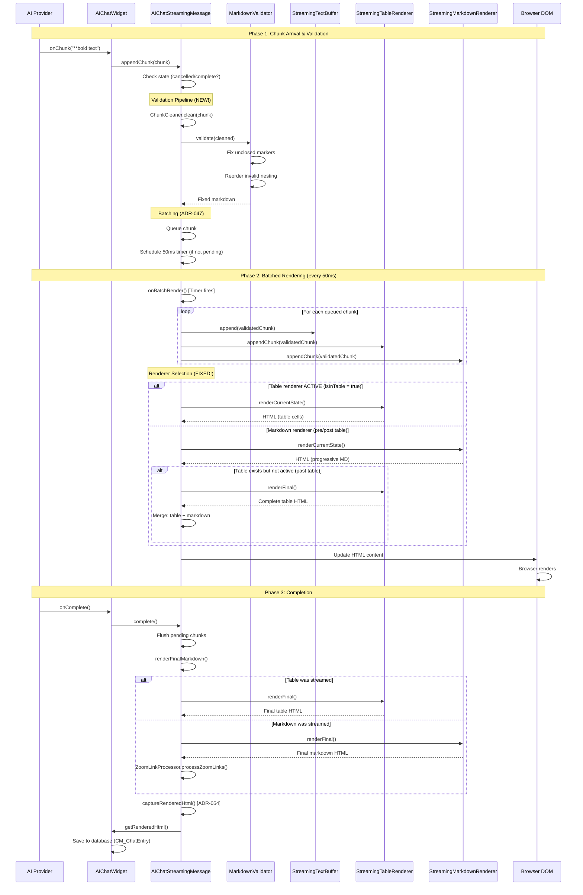
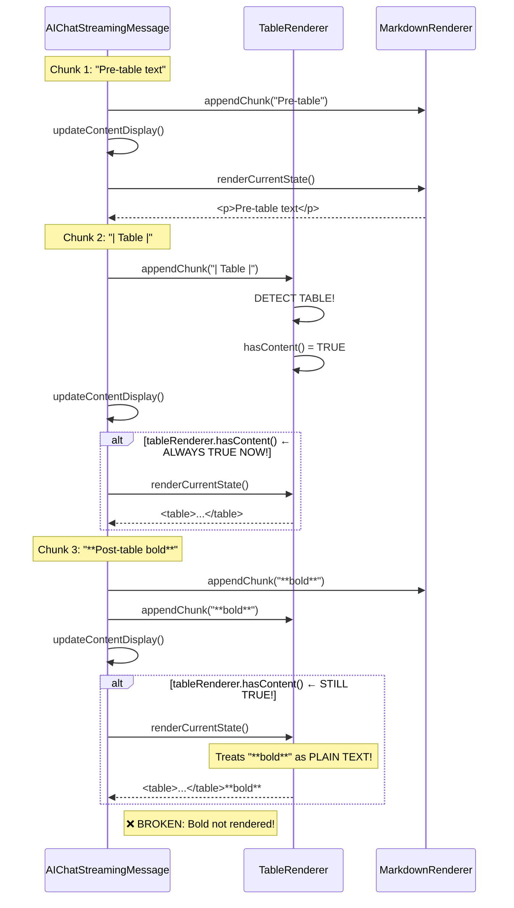
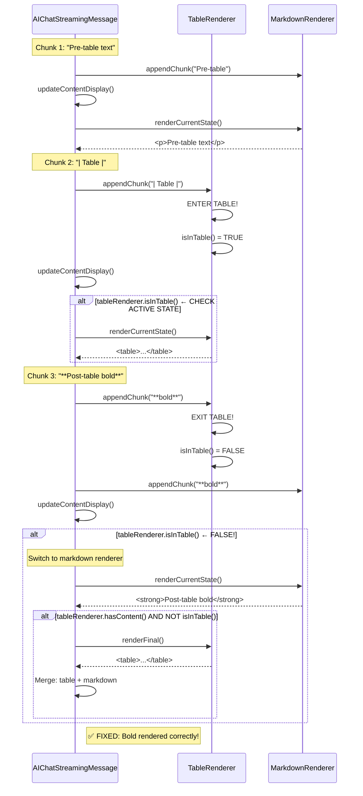
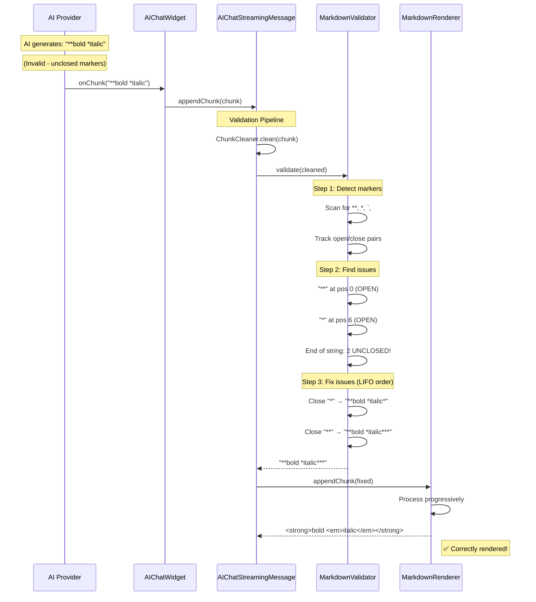
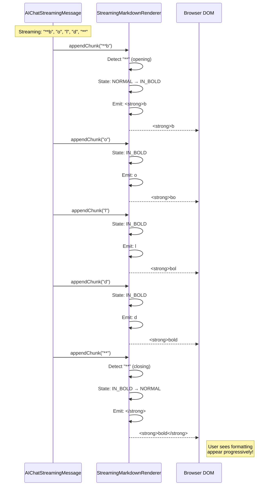
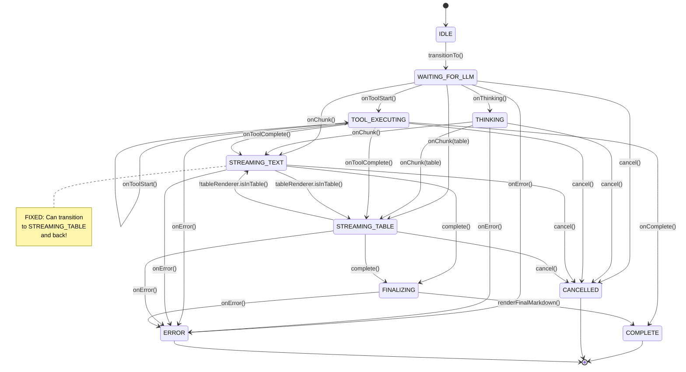

# AI Chat Streaming - Sequence Diagrams

## Diagram 1: Complete Streaming Flow (Fixed Architecture)



---

## Diagram 2: Renderer Competition (BEFORE vs AFTER)

### BEFORE (BROKEN) ❌



### AFTER (FIXED) ✅



---

## Diagram 3: Markdown Validation Flow



---

## Diagram 4: Progressive Markdown Rendering



---

## Diagram 5: Heading Validation (FIXED)

```mermaid
flowchart TD
    A[Chunk arrives: "###"] --> B{At line start?}
    B -->|Yes| C[Buffer: "###"]
    C --> D[Next chunk: " " or TAB or newline]

    D --> E{Space/Tab?}
    E -->|Yes| F[Valid heading!]
    F --> G[Open: <h3>]
    G --> H[State: IN_HEADING]

    E -->|Newline| I[Empty heading!]
    I --> J[Render: <h3></h3><br/>]
    J --> K[State: NORMAL]

    D --> L{Other char?}
    L -->|Yes| M[Invalid heading]
    M --> N[Emit literal: "###"]
    N --> K

    B -->|No| O[Not heading context]
    O --> N

    style F fill:#90EE90
    style I fill:#FFD700
    style M fill:#FF6B6B
```

---

## Diagram 6: State Machine (StreamingState)



---

## Diagram 7: Error Handling & Recovery

```mermaid
sequenceDiagram
    participant AI as AI Provider
    participant Widget as AIChatWidget
    participant Stream as AIChatStreamingMessage
    participant Validator as MarkdownValidator
    participant Renderer as MarkdownRenderer

    Note over AI: AI sends malformed chunk

    AI->>Widget: onChunk("<script>alert('xss')")
    Widget->>Stream: appendChunk(chunk)

    Stream->>Stream: ChunkCleaner.clean(chunk)
    Stream->>Validator: validate(cleaned)

    alt Validation succeeds
        Validator-->>Stream: Fixed markdown
        Stream->>Renderer: appendChunk(fixed)
        Renderer-->>Stream: Safe HTML
    else Validation fails (exception)
        Validator-->>Stream: Original markdown (fail-safe)
        Note over Validator: Log warning
        Stream->>Renderer: appendChunk(original)
        Renderer->>Renderer: Escape HTML
        Renderer-->>Stream: &lt;script&gt;...
    end

    Stream->>DOM: Update (safe HTML only)

    Note right of DOM: ✅ XSS prevented!
```

---

## Diagram 8: Performance Timeline

```
Time →
┌─────┬─────┬─────┬─────┬─────┬─────┬─────┬─────┐
│ 0ms │ 10  │ 20  │ 30  │ 40  │ 50  │ 60  │ 70  │
└─────┴─────┴─────┴─────┴─────┴─────┴─────┴─────┘

Chunks arrive:
┌─┐   ┌─┐ ┌─┐   ┌─┐     ┌─┐ ┌─┐ ┌─┐
│1│   │2│ │3│   │4│     │5│ │6│ │7│
└─┘   └─┘ └─┘   └─┘     └─┘ └─┘ └─┘
 ↓     ↓   ↓     ↓       ↓   ↓   ↓
Queue Queue Queue      Queue Queue Queue

Render batches (every 50ms):
        ↓                       ↓
      [1,2,3]                 [4,5,6,7]
        ↓                       ↓
    Validate                Validate
        ↓                       ↓
    Render                  Render
        ↓                       ↓
   Update DOM             Update DOM

Before fix: 7 DOM updates (one per chunk)
After fix:  2 DOM updates (batched)

Performance improvement: 71% reduction! 🚀
```

---

## Legend

### Symbols Used

- **→**: Sequential flow
- **↓**: Data/control flow
- **⇄**: Bidirectional flow
- **✅**: Success/Fixed
- **❌**: Failure/Broken
- **⚠️**: Warning/Caution

### Component Abbreviations

- **AI**: AI Provider (Anthropic Claude)
- **Widget**: AIChatWidget (ZK component)
- **Stream**: AIChatStreamingMessage (streaming handler)
- **Validator**: MarkdownValidator (validation utility)
- **TableR**: StreamingTableRenderer (table streaming)
- **MarkdownR**: StreamingMarkdownRenderer (markdown streaming)
- **DOM**: Browser Document Object Model

---

## Usage Notes

### Viewing Mermaid Diagrams

1. **GitHub**: Automatically renders Mermaid in markdown
2. **VS Code**: Install "Markdown Preview Mermaid Support" extension
3. **IntelliJ**: Built-in Mermaid support in markdown preview
4. **Online**: https://mermaid.live (paste diagram code)

### Diagram Updates

When updating architecture:
1. Update corresponding diagram
2. Update STREAMING_ARCHITECTURE_FIX.md
3. Regenerate from source if using diagram tool
4. Commit both .md and diagram sources

---

## References

- **Mermaid Documentation**: https://mermaid.js.org
- **Sequence Diagrams**: https://mermaid.js.org/syntax/sequenceDiagram.html
- **State Diagrams**: https://mermaid.js.org/syntax/stateDiagram.html
- **Flowcharts**: https://mermaid.js.org/syntax/flowchart.html
